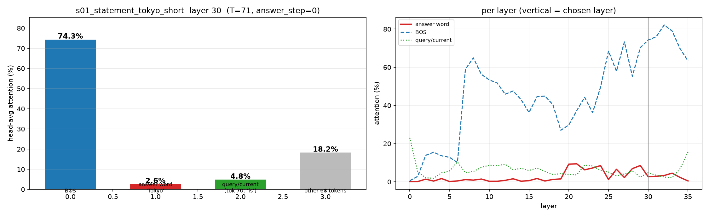
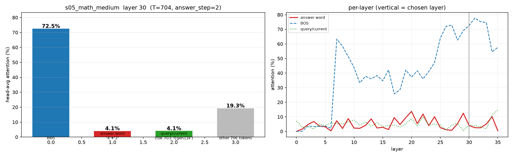
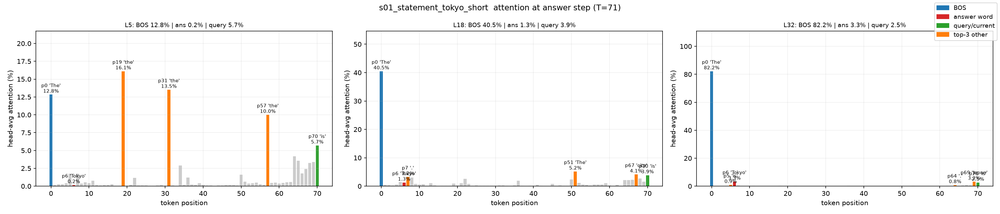
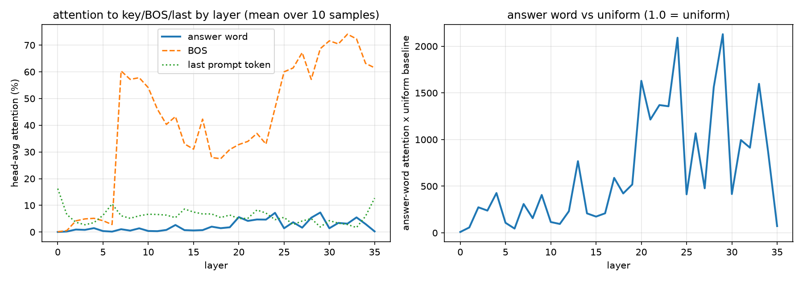

# Qwen3-4B 注意力分布实验报告

**日期**: 2026-08-30
**实验人**: (待填)
**目标**: 验证论文主张——"标准自注意力会把得分分散给所有上下文 token, 导致真正关键的信息 token 分到的注意力更少"; 并考察注意力在层间的分布变化。

---

## 1. 背景与动机

投机解码/自回归模型的注意力机制研究中有一个常见论断:

> 标准注意力会为**所有**上下文位置分配非零得分(softmax 的特性), 因此对完成任务真正关键的那个 token(例如答案词 "Tokyo")只分到很小一部分注意力; 而 BOS、当前位置等"结构 token"会分到较多注意力。

本实验用 Qwen3-4B 在 Ascend NPU 上做受控生成, 在**生成答案 token 的那一步**抓取全 36 层 × 32 头的注意力权重, 量化:

1. 关键 token(答案词 / 答案句)实际分到的注意力占比;
2. 与均匀基线相比是高是低;
3. BOS 与末尾 token 的占比;
4. 分布形态(尖峰性: top-5 集中度、熵);
5. 各层之间的变化趋势。

---

## 2. 实验设置

### 2.1 模型与运行环境
- 模型: 本地 `/home/y50063564/Qwen3-4B`(Qwen3-4B, 36 层, 32 头, head_dim 128, GQA 8 KV 头)
- 设备: Ascend 910B NPU(卡 15), bf16
- 解码: **greedy**(确定性, 可复现), `seed=42`
- 注意力实现: `attn_implementation="eager"`(eager 才返回注意力权重)

### 2.2 采集方法
- 手动自回归循环, 每步前向传 `output_attentions=True`, 抓取该步 **最后 query 位置**对全上下文的注意力权重 `[36层, 32头, T]`
- 每个样本生成 8 个 token, **答案词所在的生成步**作为分析目标步(`answer_step_first`)
- 关键位置索引: 答案词 token span、答案句 token span、BOS(0)、末尾 prompt token

### 2.3 样本设计(10 个)
答案明确写在上下文里; 填充句插在答案句与 query 之间, 使长样本中"答案距 query 更远"。长度从 71 到 1911 token 均匀铺开, 陈述式埋入 + 问答式各若干:

| id | 答案词 | 风格 | 期望生成 |
|---|---|---|---|
| s01 | Tokyo | 陈述式 | Tokyo |
| s02 | Paris | 陈述式 | Paris |
| s03 | Rome | 问答式 | (模型复述后答出) |
| s04 | blue | 陈述式 | blue |
| s05 | 42 | 陈述式 | 42 |
| s06 | Canberra | 问答式(带干扰句) | (复述后答出) |
| s07 | east | 陈述式 | east |
| s08 | Jupiter | 陈述式 | Jupiter |
| s09 | Neil | 陈述式(答案埋中段) | Neil |
| s10 | Madrid | 陈述式 | Madrid |

### 2.4 分析口径(重要)
- 注意力按**头平均**(`[L, T]`), 行和 ≈ 1。
- **均匀基线** = `1/T`(若注意力完全均匀, 每个 token 分到 `1/T`)。
- ⚠️ **口径陷阱**: 短样本的"答案句"span 包含位置 0 的 BOS(如 s01 答案句 span `[0..7]`), 因此"答案句占比"会被 BOS 主导。**结论以"答案词 token 本身"的占比为准**, 答案句占比仅作参考。

---

## 3. 数据质量校验

- `output_attentions` 正常返回 36 层权重, 每层形状 `[1, 32, T, T]`
- 每行注意力之和 ≈ 1(实测 0.9977 ~ 1.0028), softmax 归一化正确
- 答案词位置索引经人工核对(如 s05 的 "42" 被拆成 `4`+`2` 两个 token, 正确标记为 `[17,18]`)

---

## 4. 结果

### 4.1 每样本关键占比(答案生成步, 全层头平均)

| 样本 | T | 答案词% | ×均匀基线 | 答案句% | BOS% | 末尾% | top5% | 答案词排名(层0) |
|---|---|---|---|---|---|---|---|---|
| s01 Tokyo | 71 | 2.75% | ×2.0 | 55.5% | 45.9% | 6.2% | 69.7% | 69 |
| s02 Paris | 154 | 3.13% | ×4.8 | 53.4% | 44.1% | 5.7% | 66.4% | 149 |
| s03 Rome | 210 | 2.34% | ×4.9 | 5.9% | 41.7% | 5.7% | 66.2% | 196 |
| s04 blue | 310 | 1.55% | ×4.8 | 6.0% | 39.9% | 6.2% | 62.2% | 306 |
| s05 42 | 704 | 4.93% | ×34.7 | 52.0% | 41.9% | 5.0% | 63.9% | 697 |
| s06 Canberra | 1103 | 1.04% | ×11.5 | 3.8% | 41.4% | 4.7% | 66.6% | 1067 |
| s07 east | 903 | 0.41% | ×3.7 | 5.4% | 36.7% | 4.7% | 59.4% | 900 |
| s08 Jupiter | 1613 | 2.45% | ×39.6 | 9.0% | 39.6% | 6.1% | 62.4% | 1051 |
| s09 Neil | 1911 | 1.13% | ×21.6 | 8.7% | 41.6% | 8.4% | 65.5% | 1009 |
| s10 Madrid | 813 | 2.73% | ×22.2 | 7.3% | 39.5% | 6.6% | 64.4% | 793 |
| **均值** | **779** | **2.25%** | **×6.5** | — | **41.2%** | **5.9%** | **64.7%** | **中位 745** |

> 注: 均匀基线均值 0.34%(T=779)。"答案词排名"为层 0 中该 token 在注意力分布里从高到低的位次, 越小越靠前。

### 4.2 分布形态: 尖峰性
- **top-5 token 平均集中了 64.7% 的注意力**(均匀下 5 个 token 应只有 ~0.6%)→ 分布**强烈尖峰**。
- **BOS 平均 41.2%**, 是绝对主导; 末尾 token ~5.9%(≈×18 均匀)。
- 答案词绝对占比小(1~5%), 但在分布中**相对均匀基线被放大**(均值 ×6.5, 长上下文 ×20~40), 说明注意力并未完全无视它, 只是被 BOS 等结构 token 压低了绝对数值。

### 4.3 层间趋势(3 层段均值)

| 层段 | 答案词% | BOS% | 末尾% | top5% | 熵(bit) |
|---|---|---|---|---|---|
| early 0-11 | 0.64% | 24.8% | 6.7% | 53.5% | 3.43 |
| mid 12-23 | 2.49% | 34.4% | 6.6% | 57.7% | 3.28 |
| late 24-35 | **3.61%** | **64.5%** | 4.6% | **82.8%** | **1.88** |

**解读**: 越深, 注意力越"压缩"——熵从 3.4 bit 降到 1.9 bit, top-5 集中度升到 83%; BOS 占比从 25% 涨到 64%; **答案词的占比也随层深上升**(0.6% → 3.6%)。深层在把注意力"收拢"到少数关键位置。

### 4.4 单层注意力分布(聚焦式柱形图)

> 为便于阅读, 长序列采用**不均匀横轴**: 只单独列出 **BOS / 答案词 / query(当前)**, 其余所有 token 合并为一个"其余"汇总条(标注合计占比)。query = 答案生成步中做注意力的那个输入位置(step0 样本即最后 prompt token, s05 为已生成的 "4")。右侧小图为 36 层各自的答案词/BOS/query 曲线。

s01(Tokyo, T=71) 层 30:



- BOS **74.3%**, 答案词 2.6%, query 4.8%, **其余 17 个 token 共 18.2%**。

s05(42, T=704) 层 30(长序列, 聚焦式):



- BOS **72.5%**, 答案词("4"+"2") 4.1%, query(已生成 "4") 4.1%, **其余 700 个 token 共 19.3%**。
- 即使 704 个 token 的上下文, 几乎全部注意力仍集中在 BOS 一根柱子上; 关键答案 token 只占个位数百分比。

### 4.5 多层演变(浅/中/深, 带 top-token 标注)

s01 在层 5 / 18 / 32 的注意力分布对比。蓝=BOS, 红=答案词, 绿=query, **橙=其余 top-3 高注意力 token(标注了文本与占比)**:



| 层 | BOS | 答案词 | query | top-3 其它 token |
|---|---|---|---|---|
| **L5(浅)** | 12.8% | 0.2% | 5.7% | p19 "the" **16.1%**, p31 "the" 13.5%, p57 "the" 10.0% |
| **L18(中)** | 40.5% | 1.3% | 3.9% | p51 "The" 5.2%, p67 "city" 4.1%, p7 "." 3.2% |
| **L32(深)** | **82.2%** | 3.3% | 2.5% | p69 "Japan" 3.2%, p5 "is" 0.9%, p64 "." 0.8% |

**关键观察**: 浅层(L5)的注意力并未优先给答案词(仅 0.2%), 而是被多处 **"the"** 这样的高频常见词分走(共 ~40%); 越深越聚焦——L32 中 BOS 一枝独秀(82%), 答案词升到第 2 位(3.3%)。这印证了论文"关键 token 在浅层分不到多少注意力"的说法, 且揭示了深层通过 BOS 集中 + 关键 token 相对抬升来聚焦。

层 5(浅): 注意力较分散, 多个位置有可见权重; 层 18(中): 开始向少数位置集中; 层 32(深): BOS 一枝独秀, top-5 高度集中。

### 4.6 全局层间曲线



---

## 5. 结论

1. **论文主张基本成立**: 标准注意力下, 关键答案 token 的**绝对注意力很小**(平均 2.25%), 且**浅层排名垫底**(层 0 中位排名 745/779)。注意力确实被"分摊"给所有位置, 并被 **BOS(41%)** 这类结构 token 主导。
2. **重要 nuance**: 关键 token **相对均匀基线被放大**(均值 ×6.5, 长上下文 ×20~40)——注意力并未完全无视它, 只是被 BOS 汇点压低了绝对份额。
3. **分布确实尖峰**: top-5 集中 65% 注意力, 深层(24-35)达 83%, 熵低至 1.9 bit。
4. **层间关系**: 越深注意力越聚焦——BOS 与答案词的占比都随层深上升, 分布从"分散"走向"压缩"。说明深层在做**信息聚焦**, 浅层更接近均匀分摊。
5. **末尾 token** 获得稳定 ~5-8% 注意力(×18 均匀), 与 BOS 一起构成"当前/结构位置"的高注意力。

> 一句话: 论文说的"关键 token 分到注意力少"在**绝对数值**上成立, 但被 BOS 主导这一结构现象掩盖了"关键 token 仍显著高于均匀"的事实; 且深层注意力对关键 token 的占比明显更高。

---

## 6. 复现与延伸

### 复现
```bash
# 1) 采集原始数据(需 NPU + torch_npu)
ASCEND_RT_VISIBLE_DEVICES=<卡号> python3 collect_attention.py -o ./attention_raw

# 2) 分析(每样本占比 + 层间趋势 + 全局图)
python3 analyze_attention.py

# 3) 画某样本某层的分布柱形图
python3 plot_attention_layer.py --sample s01_statement_tokyo_short --layer 30 -o layer_s01_L30.png
```

### 本文件夹内容
- `REPORT.md` — 本报告
- `collect_attention.py` / `analyze_attention.py` — 采集与分析脚本
- `plot_attention_layer.py` — 旧版均匀轴柱形图(长序列不易读)
- `plot_attention_focused.py` — **改进版**: 聚焦式柱形图(突出 BOS/答案词/query, 其余汇总) + 多层 top-token 标注
- `attention_raw/` — 10 个样本的原始注意力数据(`.pt`), 含 `manifest.json`
- `attention_analysis.png` — 全局层间曲线
- `attention_layer_s01_L30.png` / `attention_layer_s05_L30.png` — 聚焦式单层图
- `multilayer_evolution_s01.png` — 浅/中/深三层对比(带 top-token 标注)

### 可延伸方向
- 逐头分析(32 头中哪些头更关注关键 token)
- 按"问答式 vs 陈述式"分组比较
- 检查关键 token 是否进入各层 top-k / top-10%
- 与 DFlash/DSpark draft 的注意力做对比(投机解码场景)
